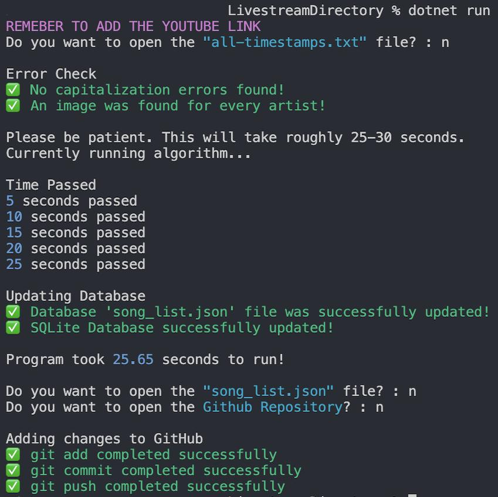

# Livestream Directory
## [Link to Website](https://michaelt-178.github.io/LivestreamDirectory/)
This is a search tool I made for the Youtuber "Corey Heuvel". Allows users to easily navigate thousands of livestream music performances. This website is currently being hosted on GitHub pages.

Here's Corey Heuvel talking about the Livestream Directory during one of his livestreams: [Youtube Link](https://www.youtube.com/live/bEBVkT9SWFY?feature=share&t=2937)

Note: I'm the "Michael L" being referred to, that's my Youtube username. The L doesn't stand for anything.


## Commands to run when you clone

Clone the repository
```
git clone https://github.com/MichaelT-178/LivestreamDirectory.git
```

Install the following library
```
pip3 install livereload
```

Run the server.
```
cd LivestreamDirectory
python3 live_server.py
```

It will run on port 8000
```
http://localhost:8000/
```

<br>


### This is what the output of running the algorithm looks like
